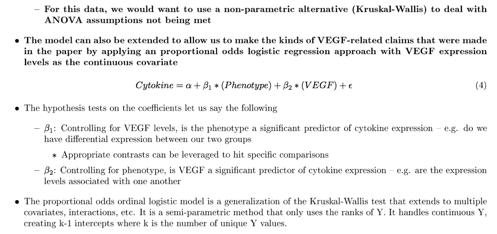

# RPPA & Proportional Odds Logistic Regression Presentation

!SLIDE dark-slide

# Reverse Phase Protein Lysate Microarrays

#### *(and why we might not need proportional odds logistic regression models to analyze them… yet)* 
Andrew Borgman // VARI Bioinformatics Core

!SLIDE left

### Overview

1. What is RPPA data?
	* A look @ some data
	* BN_16 project
	* Henry Ford work
3. Analysis ideas
	* Thoughts on statistics
4. Proportional odds LR
	* What is it?
	* ND_03 project

!SLIDE
### RPPA -- What is that?

!SLIDE dark-slide
### RPPA -- What is that?

#### Which wikipedia summarizes as…
Reverse phase protein array (RPPA) is a protein array designed as a micro- or nano-scaled dot-blot platform that allows measurement of protein expression levels in a large number of biological samples simultaneously in a quantitative manner when high-quality antibodies are available. [*`(ref)`*](http://en.wikipedia.org/wiki/Reverse_phase_protein_lysate_microarray)  

!SLIDE dark-slide
### RPPA -- What is that?
#### Then, they linked me to this really cool video…

`But I was paywalled :(`

!SLIDE left
### RPPA -- What is that?
* *"Microarray for proteins"*
	* Another 'omics source
	* Gives you post-translational info you can't get w/ mRNA expression 
	* Benefits for informing on treatment
* Becoming increasingly high-throughput
	* 100s-1,000s of spots per array
	* Multiplexing `SAMPLE X PROTEIN` is common
* Data coming out of GM is normalized
	* Normalizing image data is where most research has been
	* Just like microarrays in the early stages

!SLIDE dark-slide
### Our data

#### Henry Ford Collaboration
`70 antibodies/proteins X 120 lysates/samples`  

---

#### BN_16 project
`148 antibodies/proteins X 45 lysates/samples`  

!SLIDE left
### HF Data

#### A note from Claudius:
> That is correct - the data can be used "as is". All values have been negative control subtracted, filtered for quality (spot replicate CV's etc. - that is why some values are missing) and normalized by total protein input. The later endpoints are faced with increasing data noise due to the amount of lysate that was available for printing. We had initially planned for 50 slides, so anything beyond is stretching the input. That doesn't mean the data is no good - but you will see more values missing

!SLIDE dark-slide
### HF Data

* #### Strange "data bars", evidence of outlier data points 
* #### Transfermation could help outliers

!SLIDE dark-slide
### HF Data

#### These are microarrys.. log2 them!

* `Still have outlier issues… are they better?`  
* `Could potentially get "tricked" by your statistics`  
* `Dependent on sample size/how your sample is stratified`

!SLIDE dark-slide
### BN Data 

* #### Pretty much the same story
* #### But his is noisier

!SLIDE 

## So, how do we analyze it...

!SLIDE left
### RPPA Statistics
* Need to do something to mitigate outlier issues
	* Mann-Whitney U Test/Kruskal Wallis Test?
	* Permutation testing? (*I like this more and more*)
	* Dave's quantile normalization technique?
	* Which gives you more power *and* is most robust? We could find out.
* Was this ever discussed when microarrays came out?
	* What did that early data look like?
	* I'm assuming those normalization procedures were developed for a reason
	* Just apply the same things here?

!SLIDE dark-slide

## But I thought we were talking about proportional odds logistic regression?

!SLIDE dark-slide
### ND_03 Project

* #### Contacted to do a power analysis on some new data
* #### Interested in adding to their *count* of significant cytokines

!SLIDE
### Statistical Concerns

!SLIDE
### Statistical Concerns

!SLIDE
### Statistical Concerns

!SLIDE

### Statistical Concerns

!SLIDE dark-slide

### Simulation Results

!SLIDE dark-slide

### Who are we arguing to?

!SLIDE

# Thanks.

#### Made with [Keydown](http://github.com/infews/keydown)

